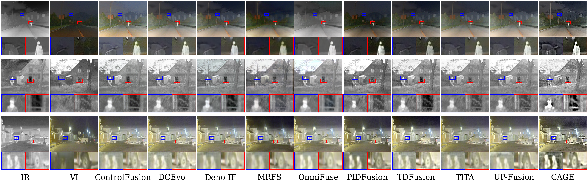
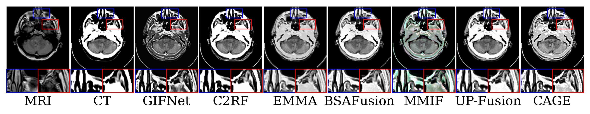
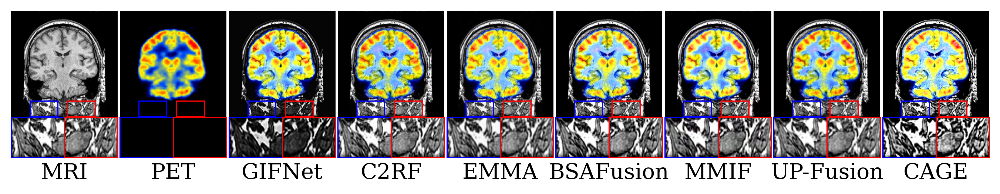
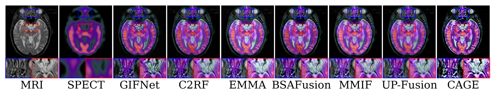

# CAGE: Content-Adaptive Grouped Experts Fusion Network

> **Paper under review. Full code will be released upon acceptance.**
>
> [Supplementary Material](assets/supplementary.pdf)

CAGE is a multi-modal image fusion network that achieves content-adaptivity at every stage of the fusion pipeline. Motivated by the observation that modality dominance varies spatially across an image pair, CAGE introduces three key components:

- **Grouped Mixture of Multi-scale Experts (GMME)**: dynamic routing among scale-specific dilated convolution experts for content-adaptive downsampling.
- **Content-Adaptive Attention Module (CAAM)**: window-level cross-modal attention that activates only where the complementary modality provides genuine informational benefit.
- **Data-driven Spatial Gradient Loss**: window-level adaptive supervision weights derived from local gradient activity ratios.

## Citation

*BibTeX entry will be provided upon publication.*

---

## Supplementary Material

### Object Detection on M3FD

---

### Hyperparameter Sensitivity

Sensitivity experiments on M3FD. The full model uses τ = 0.5 and λ = 10.

| τ | SD | SF | AG | EI | DF | VIFF |
|---|----|----|----|----|-----|------|
| 0.3 | 33.167 | 20.374 | 7.135 | 68.734 | **8.912** | 0.305 |
| 0.5 | **39.273** | 21.131 | 7.165 | **74.825** | 8.532 | **0.689** |
| 1.0 | 37.055 | **21.630** | **7.312** | 72.529 | 8.463 | 0.684 |

| λ | SD | SF | AG | EI | DF | VIFF |
|---|----|----|----|----|-----|------|
| 5  | 36.814 | 19.873 | 6.821 | 69.543 | 7.934 | 0.631 |
| 10 | **39.273** | **21.131** | 7.165 | 74.825 | **8.532** | **0.689** |
| 15 | 38.947 | 20.986 | **7.178** | **75.102** | 8.471 | 0.651 |

---

### Computational Cost (1024×768)

| Method | Venue | Params (M) | FLOPs (G) | Time (s) |
|--------|-------|-----------|-----------|---------|
| ControlFusion | NeurIPS'25 | 510.47 | 3883.41 | 2.26 |
| DCEvo | CVPR'25 | 2.00 | 2336.42 | 3.87 |
| Deno-IF | NeurIPS'25 | 1.43 | 295.20 | 1.11 |
| MRFS | CVPR'24 | 134.97 | 356.32 | 0.38 |
| OmniFuse | TPAMI'25 | 173.34 | 2632.83 | 3.38 |
| PIDFusion | TMM'25 | 0.05 | 98.34 | 0.15 |
| TDFusion | CVPR'25 | 0.06 | 46.62 | 0.26 |
| TITA | ICCV'25 | 1.39 | 967.28 | 20.47 |
| UP-Fusion | AAAI'26 | 154.82 | 2417.91 | 27.29 |
| **CAGE** | **Ours** | **4.53** | **481.20** | **1.50** |

---

### Additional Qualitative Results on Infrared-Visible Fusion

*Row 1: IR, VI, ControlFusion, DCEvo, Deno-IF, MRFS. Row 2: OmniFuse, PIDFusion, TDFusion, TITA, UP-Fusion, CAGE.*

---

### Additional Qualitative Results on Medical Image Fusion

*From left to right: source modality 1, source modality 2, GIFNet, C2RF, EMMA, BSAFusion, MMIF, UP-Fusion, CAGE.*

**CT-MRI**

**PET-MRI**

**SPECT-MRI**

